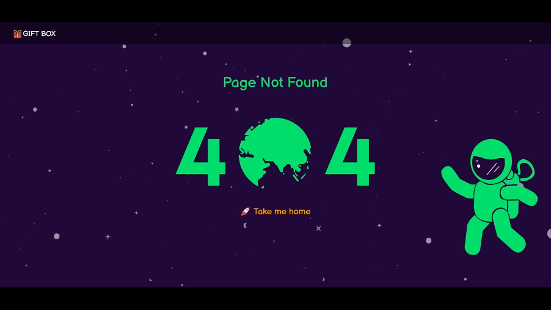

# 🎁 Gift Shop - E-commerce Gift Store

[](#)
[](#)
[](#)
[](#)
[](#)
[](#)
[](#)
[](#)


This is a React-based e-commerce gift store project. It mainly displays product listings, a shopping cart, and an admin panel.

## 🎥 Live Demo


👉 [View the website here](https://josh-yo.github.io/giftbox_website/)

## 🌿 Branches
- `main`: The primary source code for development.
- `gh-pages`: The branch used for deploying the static site via GitHub Pages.

## ✨ Main Features
### 🛍 Shopping & Product Features
- **Product Display**: Browse different gift items and view details.
- **Category Filter**: Quickly select different product categories to find the gift.
- **You Might Also Like**: A selection of suggested products to explore more gift ideas.
- **Shopping Cart**: Add, remove, clear items, and simulate checkout process.

### 🎨 UI & Visual Enhancements

- **Responsive Design (RWD)**: Optimized for mobile, tablet, and desktop devices.
- **Loading Animation**: Uses **React Loading** for full-screen animations during product fetching to improve user experience.
- **Shopping Cart Animation**: Flying effect & Toast notifications for success/fail.


- **404 Page**: Custom 404 page with **Lottie animations** to inform users when a page is not found and redirect them back to the site.



👉 [Preview the 404 Page](https://josh-yo.github.io/giftbox_website/#/wrongURL_test)


### 🔧 Optimization & Resources
- **SEO Optimization**: Enhanced visibility with meta tags for keywords, descriptions, Open Graph, and mobile-friendly settings.
- **Content Resources**: Uses free videos from **Pexels**, images from **Unsplash**, and animations from **Lottie**

### 🛠️ Admin & Management
- Add, edit, and delete products.
- Upload product images and descriptions.

## 🏗 Tech Stack

- **Frontend**: HTML, CSS, Bootstrap 5, React
- **Backend**: Node.js
- **API**: [Hexschool E-commerce API](https://hexschool.github.io/ec-courses-api-swaggerDoc/) for handling product data

## 🤖 AI Assistance

This project uses ChatGPT for writing, proofreading, and grammar checks.

## 🚀 Installation & Run

Clone the project:

```
git clone https://github.com/josh-yo/giftbox_website.git
cd giftbox_website
```

Install dependencies:
```
npm install
```

Start the development server:
```
npm start
```